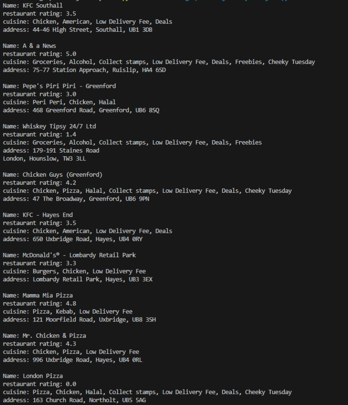
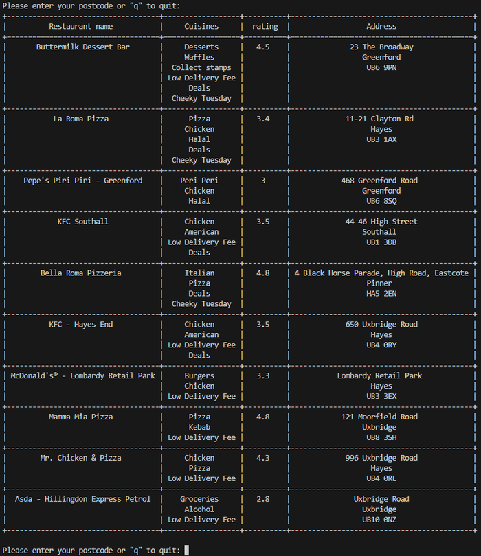

# JET Assessment README

This Python script interacts with the Just Eat API to retrieve restaurant data based on a user-provided postcode. The information is then formatted and presented in a table, displaying key details about the restaurants as mentioned in the assessment brief (Name, Cuisines, Rating - as a number, Address). The script allows users to input postcodes and view relevant restaurant information in an organised manner. This data displayed is restricted to show the first 10 restaurants returned by the initial API call.

## Why a Table Format?
The choice to present the information in a table format was deliberate, aiming to enhance user experience in the following ways:

- **Clarity and Readability:** Tables effectively separate data for each data point, providing a structured and easy-to-follow presentation. This format is visually appealing and reduces the risk of information overload.

- **Ease of Lookup:** Tables allow users to effortlessly locate and compare corresponding values for each restaurant. This makes it simple for users to focus on specific details without the need to scan through lengthy lists.

- **Visual Comfort:** Unlike lists, tables offer a more visually comfortable display. Each restaurant's information is clearly outlined, making it more pleasant for users to review and comprehend the data.

- **Facilitates Comparison:** The tabular structure facilitates easy comparison of restaurant information. Users can quickly discern differences, such as cuisines when comparing multiple restaurants side by side. This level of comparison would be challenging with a list format.

A pictorial comparison can be seen below:


| Listed Restaurant data     | Tabular Restaurant data |
| ----------------------     | ----------------------- | 
| | | 


## Requirements
- Python 3.x
- `requests` library
- `tabulate` library

Install the required libraries using:
```bash
pip install requests tabulate
```

## How to Run
#### Option 1: Run the Python Script
1. Clone the repository:
   ```bash
   git clone https://github.com/aak2510/JET-Aessement.git
   cd JET-Assessment
   ```

2. Run the script:
   ```bash
   python restaurant_display.py
   ```

3. Follow the prompts to enter a postcode or 'q' to quit the program.

#### Option 2: Run the Executable (Windows)
There is also an executable file which was created using pyinstaller. 
**WARNING** 
Users must note that this executable does not have a digital signature. If you have an anti-virus implemented it will ask you if you trust this application, I can assure you no harm will come to you from this, but feel free NOT to use this method. I am not responsible for anything that comes after running this application as it was built for the sole purpose of the assessment.
 
1. Download the executable file from the Releases section.
2. Double-click the executable file (`restaurant_display.exe`).
3. Follow the prompts to enter a postcode or 'q' to quit the program.


## Features
- The script communicates with the Just Eat API to retrieve restaurant data.
- It validates and formats user input, ensuring correct API calls.
- The response is displayed in a table format for easy readability, comparison and comprehension.
- The table includes the restaurant name, cuisines, rating - as a number, and address.
- Users can input multiple postcodes until they choose to quit.

## Assumptions and Considerations
- The script assumes a stable internet connection to make API calls.
- If an invalid postcode is provided, the API may return empty data, and the script handles this scenario appropriately.
- The user is required to input data (postcode) to run the program and display information relative to this data provided.
- The user can exit the program by entering 'q' when prompted for a postcode.

## Improvements
- Error handling can be further improved to provide more detailed information to the user.
- Handle erroneous cases, like an invalid postcode input or failed API requests, could be implemented more efficiently.
- Additional validation could be implemented to handle unexpected API response structures.
- The script could be extended to support different API endpoints or additional features.
- Add more interactive interfaces like a web application or a graphical user interface for better user experience.

Thank you for reviewing this solution! I eagerly await your response.